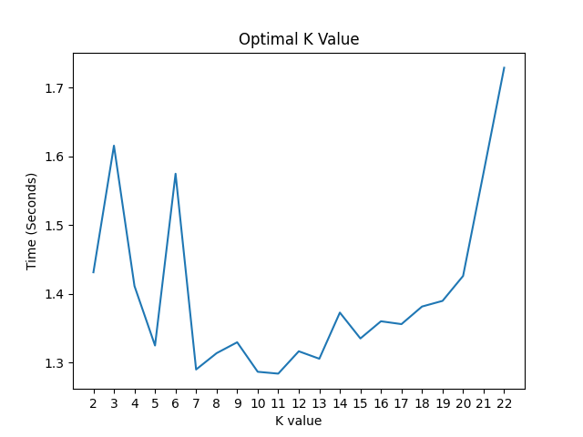
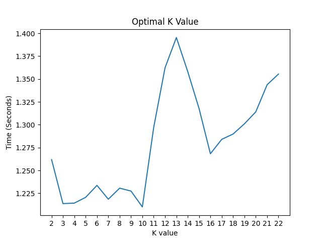

# CSCI 3412 HW 3
## Question 1
###
1-1  
**Time for recursive solution:** 0.196580171585083 seconds  
**Time for iterative solution:** 0.1880195140838623 seconds  
The iterative solution is faster.

1-2  
For each index we need to determine if the element is a plateau or valley. Starting at the 0th index we alternate valley[0], plateau[1], valley[2], plateau[3], valley[4], plateau[5], ...

The pattern for this array is the even numbered indices are valleys, while the odd numbered indices are plateaus.

Algorithm:
Iterate through the array, determine whether the index is even or odd (i % 2 == 0 or i % 2 == 1). If the index is even, check whether array[i] < array[i+1]. If this condition is not met, we swap the elements. If the index is odd, check whether array[i] > array[i+1]. If this condition is not met, we swap the elements. Since we are only iterating through the array once, the time complexity is O(n).

## Question 2
###
2-1  
Included as 2-1.pdf  
2-2   
Included as 2-2.pdf

## Question 3
###
3-1  
Included as 3-1.pdf

###
3-2  
Below is the results finding the optimal k values. K-Values 2-22 were test.   

**Each K value tested 5 times**  

2. 1.4312759399414063  
3. 1.6154974937438964  
4. 1.4112919807434081  
5. 1.3247796058654786  
6. 1.5746757507324218  
7. 1.2898841381072998  
8. 1.313675308227539  
9. 1.3294958114624023  
10. 1.2865690231323241  
11. **1.2838677406311034**  
12. 1.3163884162902832  
13. 1.3055459022521974  
14. 1.3726828575134278  
15. 1.3350430965423583  
16. 1.360042428970337  
17. 1.3559007167816162  
18. 1.3814701557159423  
19. 1.3897233486175538  
20. 1.4259849548339845  
21. 1.5767258644104003  
22. 1.7288710594177246  
 

## Optimal K Value:  11  
Graph included Optimal_K_Value.png  
   

##

**Each K value tested 20 times**  

2. 1.2618485689163208  
3. 1.2137242197990417  
4. 1.2142524719238281  
5. 1.220571756362915  
6. 1.2336604952812196  
7. 1.2185327768325807  
8. 1.2306268215179443  
9. 1.2274431347846986  
10. **1.2101097583770752**  
11. 1.2969412088394165  
12. 1.3622915744781494  
13. 1.3954447031021118  
14. 1.3582767128944397  
15. 1.3177013635635375  
16. 1.2682873845100402  
17. 1.2840245127677918  
18. 1.2898702144622802  
19. 1.301029086112976  
20. 1.3140926361083984  
21. 1.343756866455078  
22. 1.3554450154304505  
 

## Optimal K Value: 10  
Graph included Optimal_K_Value2.png  

